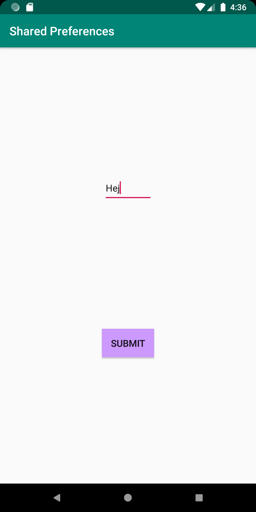
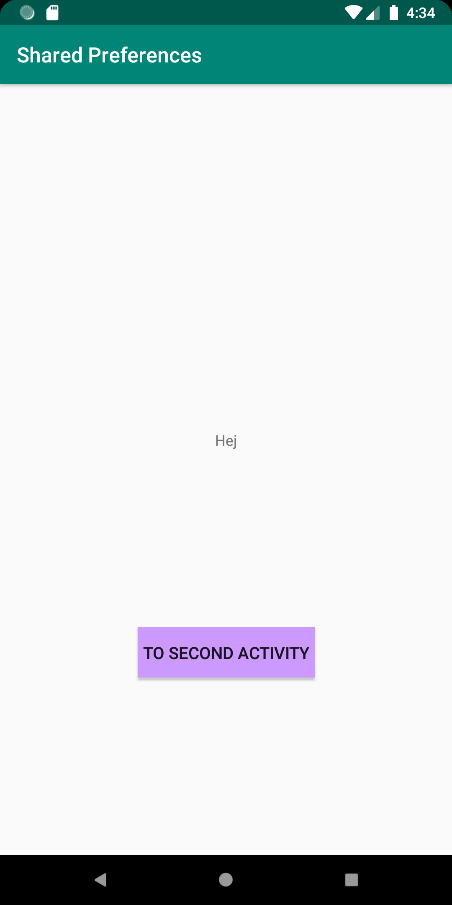

Programmering av mobila applikationer - Rapport "Preferences"

Jag startade med att lägga till en Activity som döptes till SecondActivity. Till denna activity skapades en ny layout (activity_second).
Vi har alltså två activitys, MainActivity och SecondActivity med tillhörande layouter, activity_main och activity_second.
I activity_main lades en TextView och en Button till. Knappen ska ta oss till SecondActivity och TextViewn ska visa den data som kommer att 
sparas från SecondActivity. 
I activity_second skapades en EditText och en Button. Knappen ska ta oss tillbaka till MainActivity och i EditText kommer den data som ska 
lagras och sedan hämtas i MainActivity att skrivas in.

När detta var gjort gjorde jag det möjligt att röra sig mellan activitys genom att koppla båda knapparna till en Intent. OBS findViewById
har jag gått igenom mer detaljerat i tidigare inlämningar och jag bäljer därför att i denna rapport enbart fokusera på Shared Preferences.

Nästa steg var att sätta upp variabler för Shared Preferences i både MainActivity samt i SecondActivity. 

```
...
import android.content.SharedPreferences;
...

public class MainActivity extends AppCompatActivity {

    private SharedPreferences myPreferenceRef;
    private SharedPreferences.Editor myPreferenceEditor;
...

```
Ovanstående kod visar variabler för Shared Preefernces i MainActivity.

```
...
import android.content.SharedPreferences;
...

public class SecondActivity extends AppCompatActivity {

    private SharedPreferences myPreferenceRef;
    private SharedPreferences.Editor myPreferenceEditor;
...

```
Ovanstående kod visar variabler för Shared Preefernces i SecondActivity.


Därefter skapar vi en instans för ett SharedPreference och en SharedPreferences.Editor objekt. 
Genom findViewById kopplar jag samman min TextView (my_textview) med variabeln "prefTextRef".
På sista raden avnänds "setText" för att ta den data som finns lagrad i "myPreferenceRef" och lagra den i "prefTextRef"
som i sin tur sedan kommer att visas i min TextView (som beskrivet på raden ovan).


```
@Override
    protected void onCreate(Bundle savedInstanceState) {
        super.onCreate(savedInstanceState);
        setContentView(R.layout.activity_main);
        ...

        myPreferenceRef = getSharedPreferences("key", MODE_PRIVATE);
        myPreferenceEditor = myPreferenceRef.edit();

        TextView prefTextRef= findViewById(R.id.my_textview);
        prefTextRef.setText(myPreferenceRef.getString("key", "No preference found."));
        
        ...

```

I SecondActivity gäller i samma princip som ovan nämnt. Den stora skillnaden här är egentligen "store()" metoden.
Denna metod sparar datan som skrivs in i EditText fältet (my_edittext) (visas längre ned). Metoden kallas när
använaren trycker på knappen "Submit". 

```

 @Override
    protected void onCreate(Bundle savedInstanceState) {
        super.onCreate(savedInstanceState);
        setContentView(R.layout.activity_second);

        myPreferenceRef = getSharedPreferences("key", MODE_PRIVATE);
        myPreferenceEditor = myPreferenceRef.edit();

        EditText prefTextRef = findViewById(R.id.my_edittext);
        prefTextRef.setText(myPreferenceRef.getString("key", "No preference found."));

        Button Submit = findViewById(R.id.my_button2);
        Submit.setOnClickListener(new View.OnClickListener() {
            @Override
            public void onClick(View view) {
                store();
                Intent intent = new Intent(SecondActivity.this, MainActivity.class);
                startActivity(intent);
            }
         ...

```

Här kopplar jag samman metoden "store()" och mitt EditText fälet (my_edittext). Datan som skrivs in i fältet
kommer att sparas och lagras i variablen "sharedPrefData".

```

void store() {
    EditText sharedPrefData = findViewById(R.id.my_edittext);
    myPreferenceEditor.putString("key", sharedPrefData.getText().toString());
    myPreferenceEditor.apply();
}

```

När vi återvänder från SecondActivity kommer datan som matats in i vår EditText (my_edittext) att vara sparad i 
variabeln "sharedPrefData". Genom findViewById kopplar jag samman min TextView (my_textview) med variabeln "sharedPrefData".
Sedan används "setText" för att hämta den data som finns lagrad i en Shared Precerence och sedan visas i vår TextView.

```

@Override
    protected void onResume() {
        super.onResume();
        TextView sharedPrefData = findViewById(R.id.my_textview);
        sharedPrefData.setText(myPreferenceRef.getString("key", "Name"));
    }
...

```


SecondActivity


MainActivity